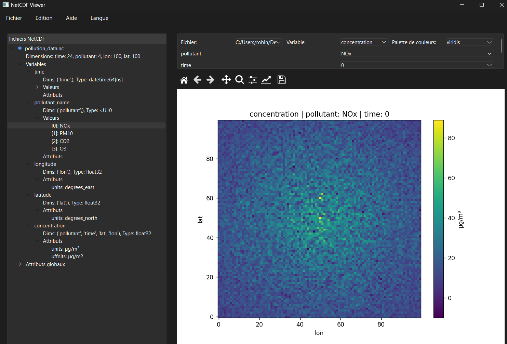

# NetCDF Lab

NetCDF Lab is an intuitive desktop application that simplifies NetCDF file manipulation. Built with PyQt6, it offers a modern interface for scientists to view, edit, and analyze NetCDF data without requiring programming knowledge.

## Features

- 🔍 Easy visualization of NetCDF file contents
- ✏️ Direct editing of variables and attributes
- 📊 Data visualization with customizable plots
- 🌍 Multi-language support (EN - FR)
- 💾 Safe file handling
- 📐 Simple and intuitive interface

## Installation

### Prerequisites

- Python 3.9 or higher
- pip (Python package installer)

### Installation

1. Clone the repository:

bash
`git clone https://github.com/dbwa/netCDF-Lab.git
cd netCDF-Lab`

2. Install dependencies:

bash
`pip install -r requirements.txt`

3. Run the application:

bash
`python -m netcdflab.main`

## Usage

1. Launch the application:

bash
`python -m netcdflab.main`

2. Open a NetCDF file:
   - Drag and drop a .nc file into the application
   - Or use File > Open from the menu
   - Or use the "Open File" button

3. Navigate through the data:
   - Browse variables and attributes in the tree view
   - Double-click values to edit them
   - Right-click for context menu options

4. Visualize data:
   - Select a variable to plot
   - Choose visualization options
   - Export plots if needed

5. Save changes:
   - Use File > Save or Ctrl+S
   - Use File > Save As to create a new file

## Contributing

Contributions are welcome! Please feel free to submit a Pull Request.

1. Fork the repository
2. Create your feature branch (`git checkout -b feature/AmazingFeature`)
3. Commit your changes (`git commit -m 'Add some AmazingFeature'`)
4. Push to the branch (`git push origin feature/AmazingFeature`)
5. Open a Pull Request

## License

This project is licensed under the MIT License - see the [LICENSE](LICENSE) file for details.

## Acknowledgments

- Built with [PyQt6](https://www.riverbankcomputing.com/software/pyqt/)
- Uses [xarray](https://xarray.dev/) for NetCDF handling
- Visualization powered by [Matplotlib](https://matplotlib.org/)

## Support

If you encounter any problems or have suggestions:
- Open an issue on GitHub
- Contact the maintainers

## Roadmap

> 🚀 **Project Status**: Early development phase. The application is in its initial stages with very basic functionality.

### Phase 1: Core Features
- [ ] Extend support for all NetCDF format usages
- [ ] Implement robust validation module for NetCDF files
- [ ] Add export capabilities to various data formats
- [ ] Enhance coordinate system management
- [ ] Add tests

### Phase 2: Advanced Data Manipulation
- [ ] Develop advanced editing operations (averaging, combining variables)
- [ ] Enable creation of new variables from existing ones
- [ ] Add support for batch operations
- [ ] Implement cross-file operations between open NetCDF files

### Phase 3: Automation & User Experience
- [ ] Export manual operations as standalone Python scripts
- [ ] Create operation templates for common workflows
- [ ] Enhance UI/UX for more intuitive interactions

## Authors

- dbwa - RV - [GitHub](https://github.com/dbwa)

## Project Status

Early development - Beta version
